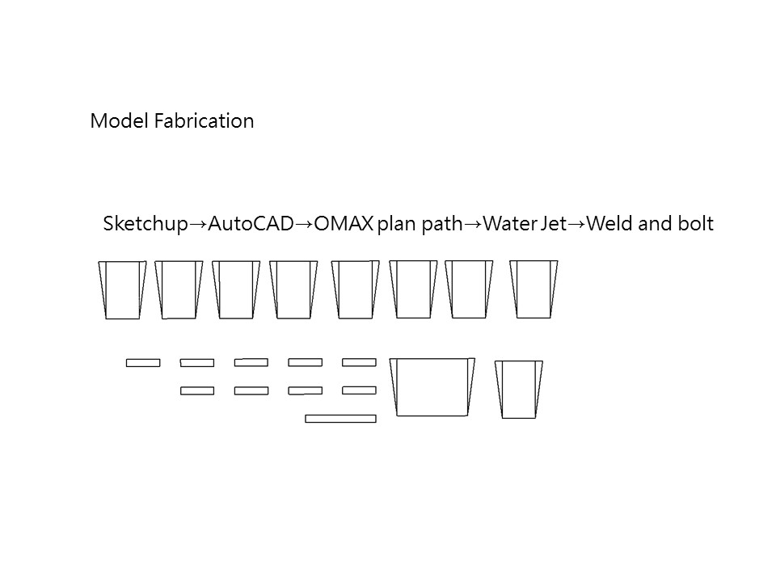

<!-- Slideshow container -->

  <!-- Full-width images with number and caption text -->
  

    
  

  

    
  

  

    
  

  

    
  

  

    
  

  

    
  

  

    
  

  

    
  

  

    
  

  

    
  

  

    
  

  

    
  

  

    
  

  

    
  

  
  <!-- Next and previous buttons -->
  <i class="fas fa-angle-left" onclick="plusSlides(-1)" id="allBlack"></i>
  <i class="fas fa-angle-right" onclick="plusSlides(1)"></i>

<!-- The dots/circles -->

  
  
  
  
  
  
  
  
  
  
  
  
  
  

 In this project, we plan to redesign and decorate the new student activity space in the Department of Civil Engineering at National Taiwan University. The existing space has dusty, poor lighting, and crowded issues. After observations and user interviews, we targeted redesigning the lighting system and the stairs in the space to fit users' needs. The design process went through several rounds of scaled prototyping, evaluating, and modifying. The final outcome was fabricated and assembled in the existing student activity space to collect feedback from users and delivered to future classes as the preliminary study.
