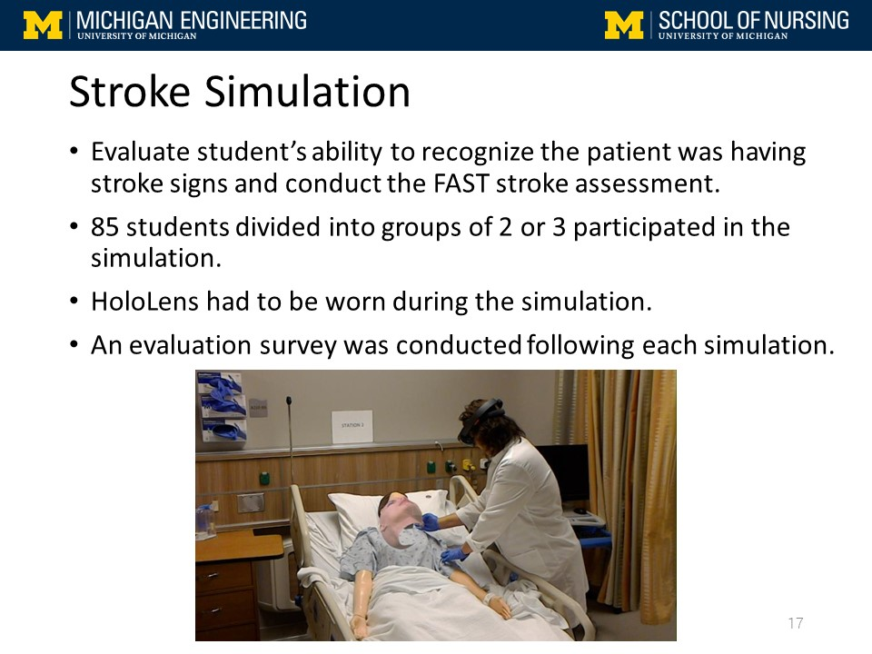
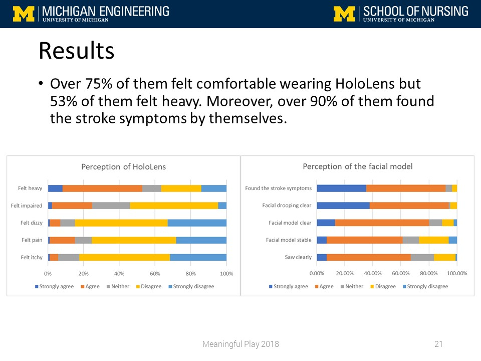
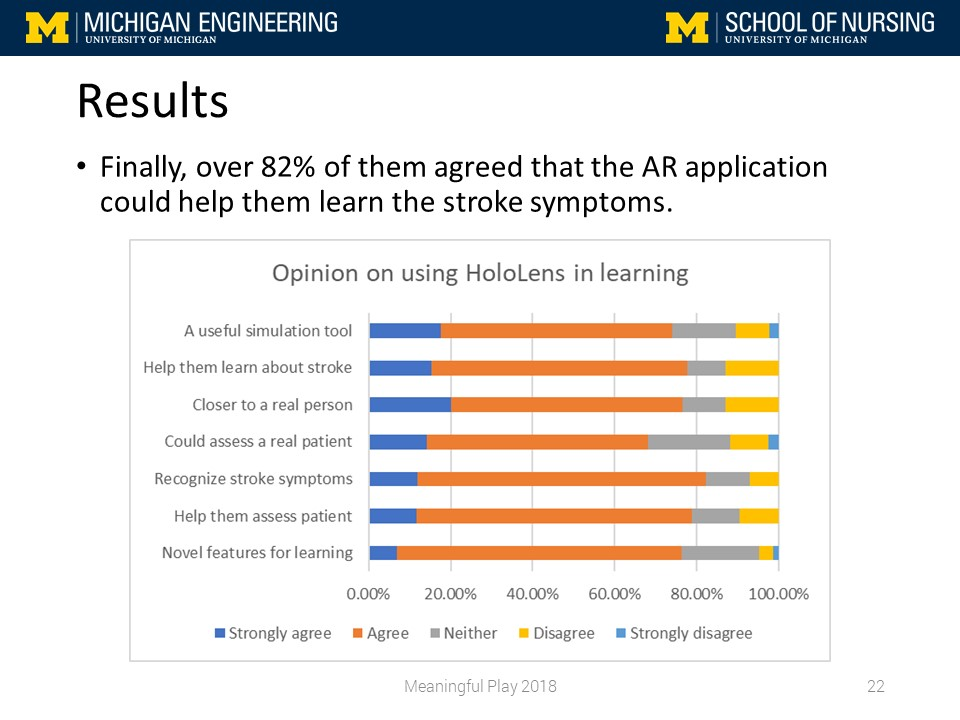

<!-- Slideshow container -->

  <!-- Full-width images with number and caption text -->
  

    
  

  

    
  

  

    
  

  

    
  

  

    
  

  

    
  

  

    
  

  

    
  

  

    
  

  

    
  

  

    
  

  

    
  

  

    
  

  

    
  

  

    
  

  

    
  

  

    
  

  

    
  

  

    
  

  

    
  

  <!-- Next and previous buttons -->
  <i class="fas fa-angle-left" onclick="plusSlides(-1)" id="noArrow"></i>
  <i class="fas fa-angle-right" onclick="plusSlides(1)"></i>

<!-- The dots/circles -->

  
  
  
  
  
  
  
  
  
  
  
  
  
  
  
  
  
  
  
  

 The development of extended reality in recent years is opening doors for using extended reality devices (virtual reality, augmented, and mixed reality devices) in education and healthcare. The purpose of this pilot study was to test the use of augmented reality in teaching healthcare practitioners in a stroke assessment simulation designed for clinical training, where students at nursing school are targets in the study. To conduct our feasibility, a simulation application was developed for the mixed reality device that projects a human face displaying facial drooping (a symptom of stroke) onto a computerized training mannequin. Nursing students were then placed in a clinical simulation wherein they wore the mixed reality device and performed an assessment of their mannequin patient to identify the symptom of stroke and act accordingly. The students completed a survey following their simulations, and then provided feedback on the device and the quality of their experience. The results of the study show that most students enjoyed the simulation and felt that extended reality would be a very useful educational tool for clinical training and healthcare. Further development of the program and device is underway, and future tests will be conducted. The results from this study will be helpful in further progressing the development of extended reality, and the use of these devices in healthcare training.

