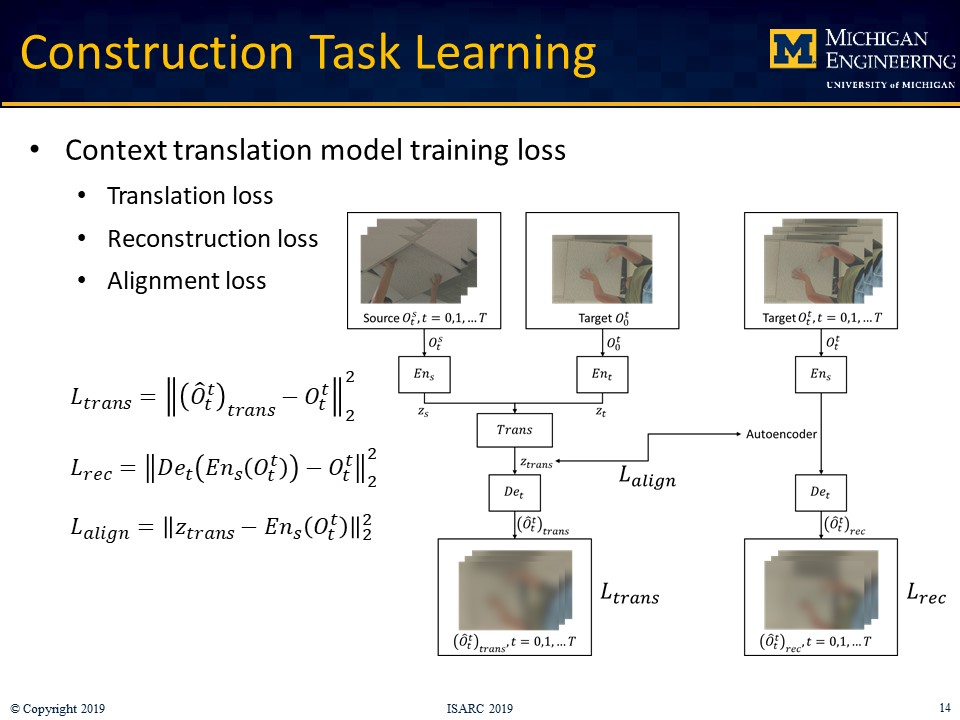

<!-- Slideshow container -->

  <!-- Full-width images with number and caption text -->
  

    
  

  

    
  

  

    
  

  

    
  

  

    
  

  

    
  

  

    
  

  

    
  

  

    
  

  

    
  

  

    
  

  

    
  

  

    
  

  

    
  

  

    
  

  

    
  

  

    
  

  

    
  

  

    
  

  

    
  

  

    
  

  

    
  

  
  

    
  

  

    
  

  

    
  

  <!-- Next and previous buttons -->
  <i class="fas fa-angle-left" onclick="plusSlides(-1)" id="noArrow"></i>
  <i class="fas fa-angle-right" onclick="plusSlides(1)"></i>

<!-- The dots/circles -->

  
  
  
  
  
  
  
  
  
  
  
  
  
  
  
  
  
  
  
  
  
  
  
  
  

 Robots can assist workers in performing physically-demanding construction tasks, which are typically quasi-repetitive, wherein the geometry of the workspace is dissimilar despite similar tasks. As a result, robots must determine motion trajectories based on the encountered workspace geometry. Learning from Demonstration (LfD) methods have the potential to be used in teaching robots specific tasks through human demonstration, such that robots can then perform learned tasks under different conditions. In this paper, the LfD method is investigated to teach robots how to perform quasi-repetitive construction tasks. Considering ceiling tile installation as the experimental process, the tasks of maneuvering and positioning tiles in a ceiling grid are defined as the target knowledge to be learned. Using a set of human demonstration videos, the designed approach first translates the physical work context, e.g., the pose of the tile, to the target digital twin, i.e., the workspace as-perceived by the robot. The Reinforcement Learning method is then applied to generate the control policy for the robot to perform the subsequent tasks. The proposed method is evaluated in the Robot Operating System (ROS) Gazebo simulator using a KUKA mobile industrial robotic arm emulator and 60 different scenes as test cases. The results show a 78% success rate in installing ceiling tiles based on 3000 virtual and 85 real demonstration videos. The success rate tends to continually rise with an increase in the number of real demonstration videos, confirming the promise and applicability of the LfD method in teaching robot apprentices to perform quasi-repetitive tasks on construction sites.

